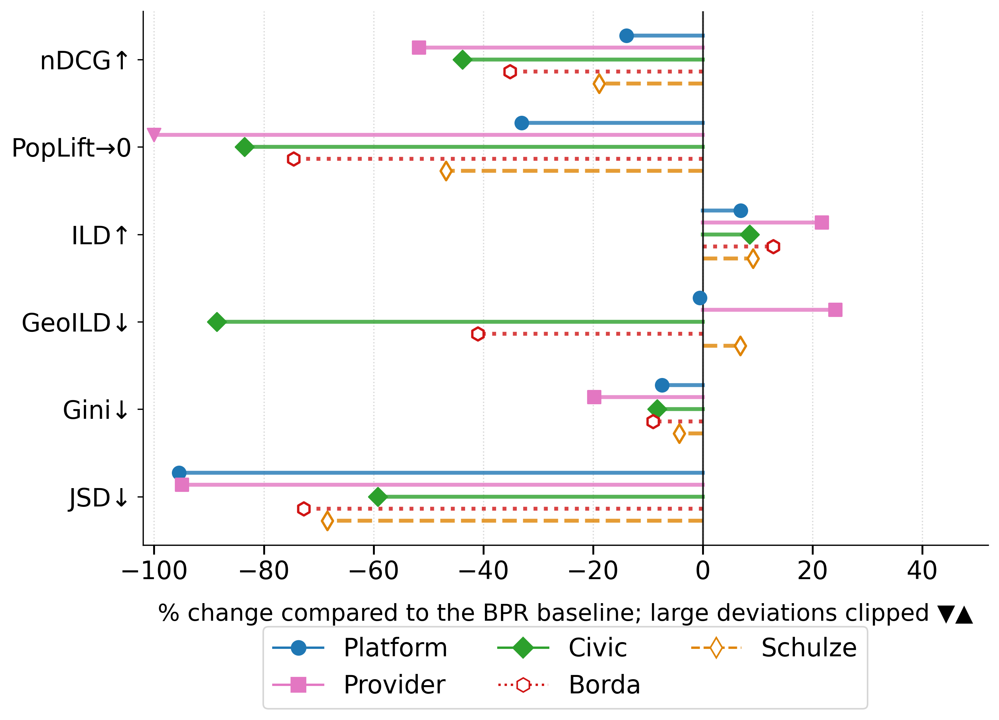
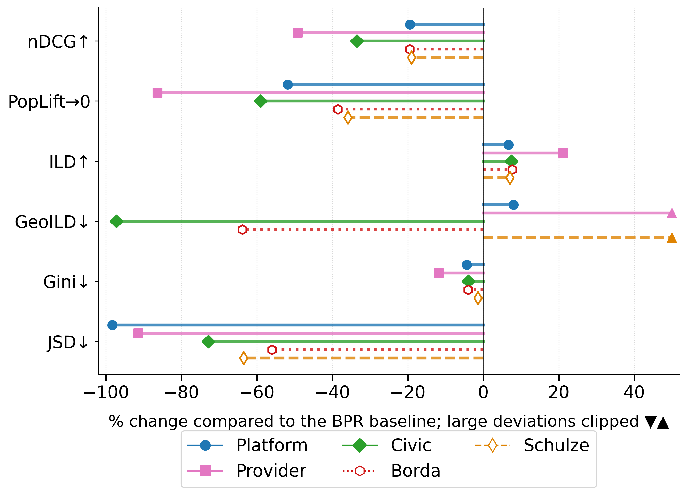
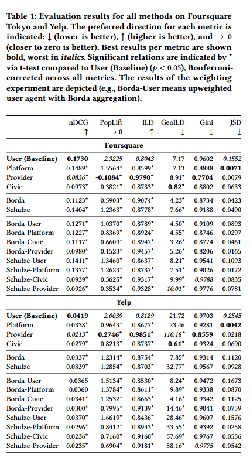

# Multistakeholder Alignment in POI Recommendation


## Abstract
Point-of-interest (POI) recommender systems assist users in discovering relevant locations. While optimizing recommendations for users is crucial, it can compromise the interests of other stakeholders such as business owners, platforms like Foursquare and Yelp, or local governments. Existing research typically focuses on optimizing algorithms to the needs of a single stakeholder only. 
We address this limitation using a multistakeholder approach that decouples the base recommendation from stakeholder-specific interventions. Starting with user-centric baseline recommendations, we model the stakeholder objectives as independent agents, each applying a distinct re-ranking strategy: (i) the platform agent uses calibrated popularity to align with historical popularity distributions, (ii) the provider agent applies maximal marginal relevance to improve recommendation diversity across local businesses and POIs, and (iii) the civic agent utilizes geographic proximity-based re-ranking to reduce travel distances and the mobility burden of tourism. 
The outputs of these agents are combined using voting methods from computational social choice. We evaluate our approach on datasets from Foursquare and Yelp, and our results demonstrate that recommendations generated via a single stakeholder agent indeed harm other stakeholder objectives. In contrast, our multistakeholder approach achieves a more balanced trade-off across various stakeholder objectives. We also explore the effect of different voting methods on stakeholder representation while maintaining extensibility for other multistakeholder scenarios.
## Results

##  Percentage Change of the individual stakeholder agents and the social choice methods compared to the user-centered baseline
<p float="left">
  
  
</p>


## Full Results
<p float="center">
  
</p>


## Manual to Reproduce Results

The manual below includes all necessary steps (data sample generation, preprocessing, saving data files for plug-in into recommendation frameworks, re-ranking for stakeholder objectives, accuracy and beyond-accuracy evaluation) to generate baseline and re-ranked POI recommendations and evaluate their performance. To facilitate the reproducibility of the recommendations, we use the recommender frameworks [RecBole](https://github.com/RUCAIBox/RecBole) for baseline generation.  

#### Note: If you don't want to follow the entire pipeline, you can take a shortcut to the "General Evaluation" to perform this based on the results from the foursquaretky (and yelp) datasets.

### Preprocessing

1. create a virtual environment and activate it. 

Python < 3.12 (e.g., 3.11.8)
```
python3.11 -m venv venv
source venv/bin/activate
```
2. Install the requirements from `pyproject.toml`

3. Create/update the script `globals.py` in the root directory and add the line `BASE_DIR = /path/to/your/base/directory/`. This base directory will be used to store the datasets and the recommender outputs. 

Note: The dataset samples are provided for both dataset, hence you can skip steps 4-5. \

4. In the `BASE_DIR` proceed by creating dataset folders with the following structure `<dataset_name>_dataset` and then place the original, (unzipped) data files in this folder.

Links to the original datasets used in this study: 
* [yelp_dataset](https://www.yelp.com/dataset)
* [foursquaretky_dataset](https://www.kaggle.com/datasets/chetanism/foursquare-nyc-and-tokyo-checkin-dataset)

5. Data Sampling & Preprocessing: Add the desired datasets to `globals.py` and call `data_sampling.py`from the root directory. The samples include three user groups; 1/3 that visited the most popular POIs, 1/3 around the popularity median and 1/3 that visited the least popular POIs (default n=1500 users). The train/validation/test (65/15/20) splits are performed based on a user-based temporal split & duplicate check-ins are transformed into a check-in count. The samples are processed to fit the layout for RecBole and CAPRI and saved into the respective subfolders in the `BASE_DIR`. 

### Generate Recommendations (Baseline)
Generate Recommendations using [RecBole](https://github.com/RUCAIBox/RecBole) for general recommender models. RecBole works as a pip package inside this project. NOTE: main study uses numpy==2.3.5; if you need to run your own RecBole recommendations, an older numpy version (e.g., 1.26.4) is needed.

1. Inside the folder `recbole_general_recs/dataset` create a folder with the structure `<dataset name>_sample` (e.g., foursquaretky_sample) & copy the files from your `BASE_DIR/foursquaretky_dataset/processed_data_recbole` into that folder. 

2. Hyperparameter optimization: has already been done and saved to recbole_general_recs/config - if you wish to re-do it, cd to recbole_general_recs and run `python3 config_hyperparameter_creator.py` -- see hyper.test for the tested parameters

3. cd back to the project's root directory, run: `python3 recbole_general_recs/recbole_full_casestudy.py`
This creates a folder inside the `BASE_DIR/<dataset>` named "recommendations/BPR+timestamp including the config file that produced the recommendations, the general evaluation and the top_k_recommendations

4. Note: In case of an error in Recbole, try: \
```pip3 install hyperopt``` \
```pip3 install ray```  \
```pip3 install "ray[tune]"``` \
In the recbole package in your virtual environment, comment out the line #from kmeans_pytorch import kmeans in the following path: recbole/model/general_recommender/ldiffrec.py

In the hyperopt package, in hyperopt/pyll/stochastic.py", line 100, in randint
    return rng.integers(low, high, size) --> exchange rng.integers for rng.randint

5. call `postprocess_baseline_top_k.py`from the root directory. 

### Re-Ranking Agents
Next, we are re-ranking the baseline recommendations for each stakeholder objective.


* Platform agent: call `platform_reranker.py`from the root directory (find top-k Recommendations under: "datasets/recommendations/"model output"/cp/")
* Provider Agent: call `provider_reranker.py`from the root directory (find top-k Recommendations under: "datasets/recommendations/"model output"/mmr/")
* Civic Agent: call `civic_reranker.py`from the root directory (find top-k Recommendations under: "datasets/recommendations/"model output"/geo/")

### Social Choice Aggregation
* Run: social_choice_aggregation.py (find top-k Recommendations under: "datasets/recommendations/"baseline output"/borda/" or ".../schulze/)
Note: For the weighting experiments, where a single stakeholder is upweighted compared to the others to assess their difference, set boosted to True. 

#### General Evaluation
The script `offline_evaluation.ipynb` includes the full evaluation and plots. The evaluation metrics are found in `evaluation_metrics.py`. 


